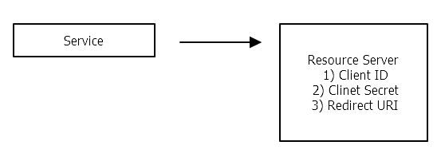

# OAuth

## Role
```
- User
    - ResourceOwner
    
- MainService
    - Client(유저에게 회원가입을 대신하는 OAuth 를 제공하고 서비스 제공)

- SubService
    - ResourceServer
```

## Register

- 사전 등록
    - Client는 Resource Server의 API를 사용하여 Resource Owner의 정보를 이용하려면 미리 사전에 등록(register)을 해야 함.

- Client ID
    - 등록하고자 하는 Service App의 식별 정보
    - 외부 노출 가능

- Client Secret
    - 등록하고자 하는 Service App의 식별 정보
    - 외부 노출 불가(관리 필수)

- Authorized redirect URIs
    - 권한이 부여되면 key code 를 보낼 등록되어 있는 Service URI
    - kakao 등록 URI : http://localhost:5173/oauth/kakao/info
    